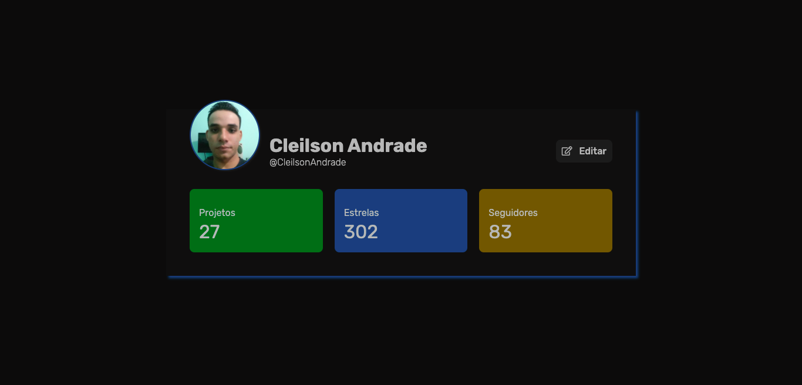

<div align="center">
  <h1>Perfil de usuário</h1>
  <p>Perfil de um usuário simples, visando estudos sobre CSS.</p>
  
</div>

# 📒 Índice
* [Descrição](#descrição)
* [Requisitos Funcionais](#requisitos)
* [Tecnologias](#tecnologias)
* [Design](#design)
  * [Cores](#cores)
  * [Fontes](#fontes)
  * [Ícones](#icones)
* [Instalação](#instalação)
* [Links DevChallenge](#links-devchallenge)
* [Licença](#licença)

# 📃 <span id="descrição">Descrição</span>
Página desenvolvida com base nos requisitos do [desafio](https://github.com/devchallenge-io/profile-component) oferecido pela [**DevChallenge**](https://devchallenge.now.sh/) e adicionada algumas implementações.

# 📌 <span id="requisitos">Requisitos Funcionais</span>
- [x] Edições de nome de usuário, link para o GitHub e avatar<br>
- [x] Validação de dados<br>
- [x] Modal<br>
- [x] Animações<br>
- [x] Responsividade<br>

# 💻 <span id="tecnologias">Tecnologias</span>
- **HTML**
- **CSS**
- **JavaScript**

# 🎨 <span id="design">Design</span>
- O modelo final para desktop e mobile está disponível na pasta `./design`
- Imagens disponíveis na pasta `./imgs`<br>

- <span id="cores">Cores<br></span>
  * #0C0B0B<br>
  * #0F0E0E<br>
  * #1b1b1b<br>
  * #B7B7B7<br>
  * #046313<br>
  * #044A7D<br>
  * #725200<br>

- <span id="fontes">Fontes<br></span>
  * Rubik

- <span id="icones">Ícones<br></span>
  * Font Awesome

# 🚀 <span id="instalação">Instalação</span>
```bash
  # Clone este repositório:
  $ git clone https://github.com/CleilsonAndrade/profile-component-devchallenge
  $ cd ./profile-component-devchallenge
```

# Links DevChallenge
**Site:** https://www.devchallenge.com.br/ <br>
**Discord:** https://discord.gg/yvYXhGj <br>
**Linkedin:** https://www.linkedin.com/company/devchallenge/<br>
**Twitter:** https://twitter.com/dev_challenge<br>
**Instagram:** https://www.instagram.com/devchallenge/<br>

# 📝 <span id="licença">Licença</span>
Esse projeto está sob a licença MIT. Veja o arquivo [LICENSE](LICENSE) para mais detalhes.

---

<p align="center">
  Feito com 💜 by CleilsonAndrade
</p>